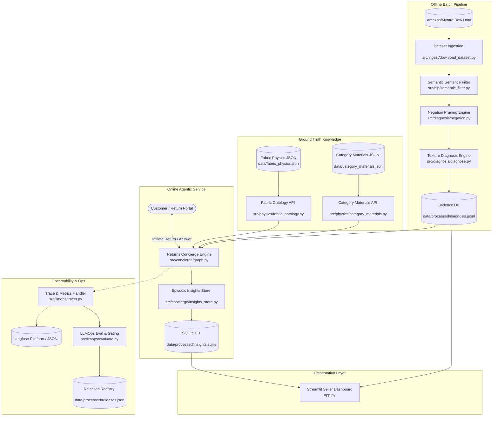
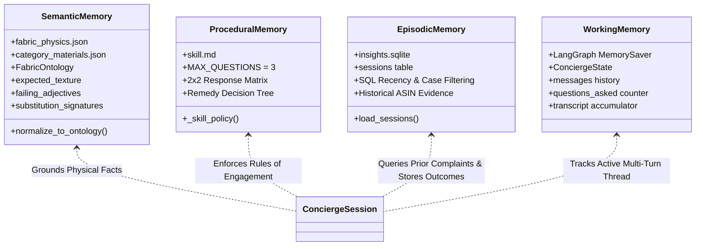
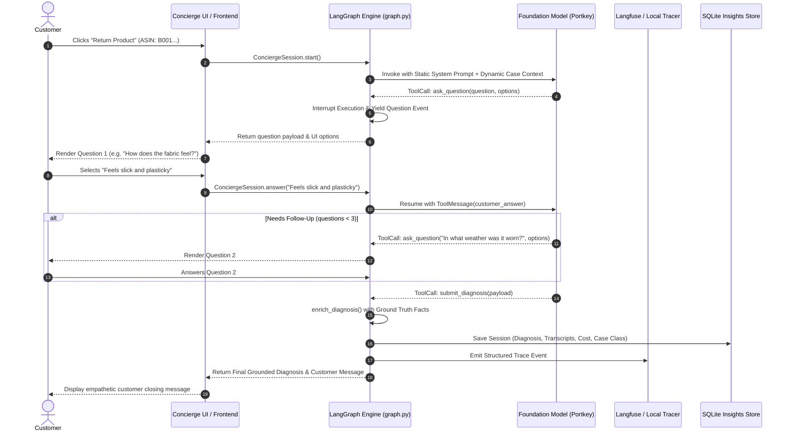

# 01. System Architecture & Core Design

## Architectural Overview

The **True-Texture Intelligence Platform** is architected as a modular, decoupled AI system designed to operate both in batch analytical mode (mined catalog insights) and low-latency real-time mode (interactive customer return concierge).



---

## The 3-Tier Cognitive Memory Architecture

The agentic return concierge utilizes a specialized cognitive memory architecture designed for predictability, zero-latency grounding, and high KV-cache efficiency.



### 1. Semantic Memory (Durable Domain Knowledge)
* **Storage**: [`data/fabric_physics.json`](file:///d:/Downloads/projects/True-texture%20detector%20AI%20system/data/fabric_physics.json) & [`data/category_materials.json`](file:///d:/Downloads/projects/True-texture%20detector%20AI%20system/data/category_materials.json).
* **Role**: Provides authoritative, deterministic fabric physics. Separates **fiber** expectations (cotton, linen, silk) from **weave/construction** mechanics (corduroy, satin, velvet, fleece).
* **Rationale**: RAG over a small fixed domain ontology introduces vector retrieval misses and adds 150–300ms of latency. Direct injection ensures 100% precision.

### 2. Procedural Memory (*How-to-Act* Policy)
* **Storage**: [`src/concierge/skill.md`](file:///d:/Downloads/projects/True-texture%20detector%20AI%20system/src/concierge/skill.md).
* **Role**: Governs the interview strategy, maximum question budget, conversational tone, and the deterministic 2×2 Response Matrix (Material Defect vs. Weather Discomfort).
* **Rationale**: Markdown-based policy isolation decouples prompt engineering from Python orchestration code, allowing non-engineering domain experts to refine return policies.

### 3. Episodic Memory (Historical Case & Transcript Records)
* **Storage**: SQLite database ([`data/processed/insights.sqlite`](file:///d:/Downloads/projects/True-texture%20detector%20AI%20system/data/processed/insights.sqlite)) via [`src/concierge/insights_store.py`](file:///d:/Downloads/projects/True-texture%20detector%20AI%20system/src/concierge/insights_store.py).
* **Role**: Captures completed sessions, user transcripts, classified outcomes, and token costs. Enables SQL-speed aggregations and feeds prior product evidence into future sessions.

### 4. Working / Short-Term Memory (Session State)
* **Storage**: In-memory LangGraph checkpointer ([`MemorySaver`](file:///d:/Downloads/projects/True-texture%20detector%20AI%20system/src/concierge/graph.py#L26)).
* **Role**: Maintains state across tool calls and user interactions within an active thread (`thread_id`).

---

## Prefix Optimization & KV-Cache Strategy

A critical design consideration in high-throughput customer support agents is **KV Cache reuse** on LLM inference servers (e.g., Anthropic Prompt Caching, OpenAI automatic caching, vLLM RadixAttention).

### Problem Statement
Because prompt caching performs exact token matching from token `0` forward, placing dynamic per-request metadata (such as product title or ASIN) at the beginning of the `SystemMessage` invalidates the cache across concurrent users returning different items.

### Optimized Architecture
To achieve optimal cache efficiency and strong prompt injection isolation:

```
┌─────────────────────────────────────────────────────────────┐
│ 1. SystemMessage (100% Invariant Prefix)                     │ ─── [GLOBAL KV CACHE HIT]
│    - Role definition                                        │     Cached across all tenants,
│    - Procedural Memory (skill.md)                           │     users, and products.
├─────────────────────────────────────────────────────────────┤
│ 2. HumanMessage / Turn 1 Context Payload                    │ ─── [DYNAMIC TAIL DELTA]
│    <case_context>                                           │     Computed once per session
│       <product title="..." listed_materials="..." />        │     as a lightweight tail (~200 tokens).
│       <fabric_ontology> ... </fabric_ontology>              │
│       <weave_construction> ... </weave_construction>        │
│       <prior_evidence> ... </prior_evidence>                │
│    </case_context>                                          │
│    The customer just clicked 'Return item'. Begin interview.│
└─────────────────────────────────────────────────────────────┘
```

1. **Global Cache Hit on System Prompt**: The system prompt is 100% static, guaranteeing that concurrent requests across thousands of distinct products share the identical pre-warmed KV cache.
2. **Multi-Turn Cache Hit within Session**: On Turns 2, 3, and 4, the entire prefix (System prompt + Initial Case Context + Turn 1 messages) is 100% cached; only the customer's delta response is processed.
3. **Prompt Injection Defense**: Product titles and user-generated review texts are enclosed in structured XML tags within the user space rather than executing in the authoritative system instruction space.

---

## Multi-Turn Interaction Lifecycle


