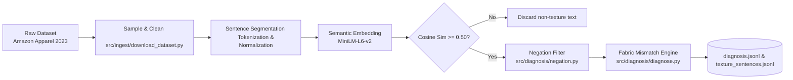
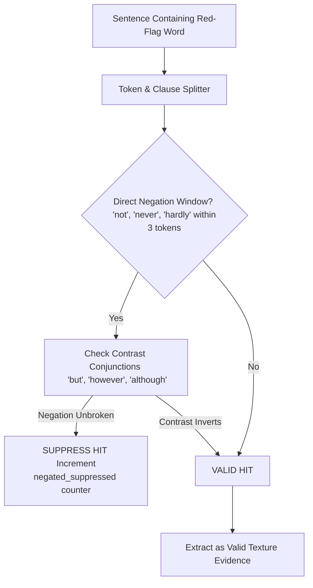
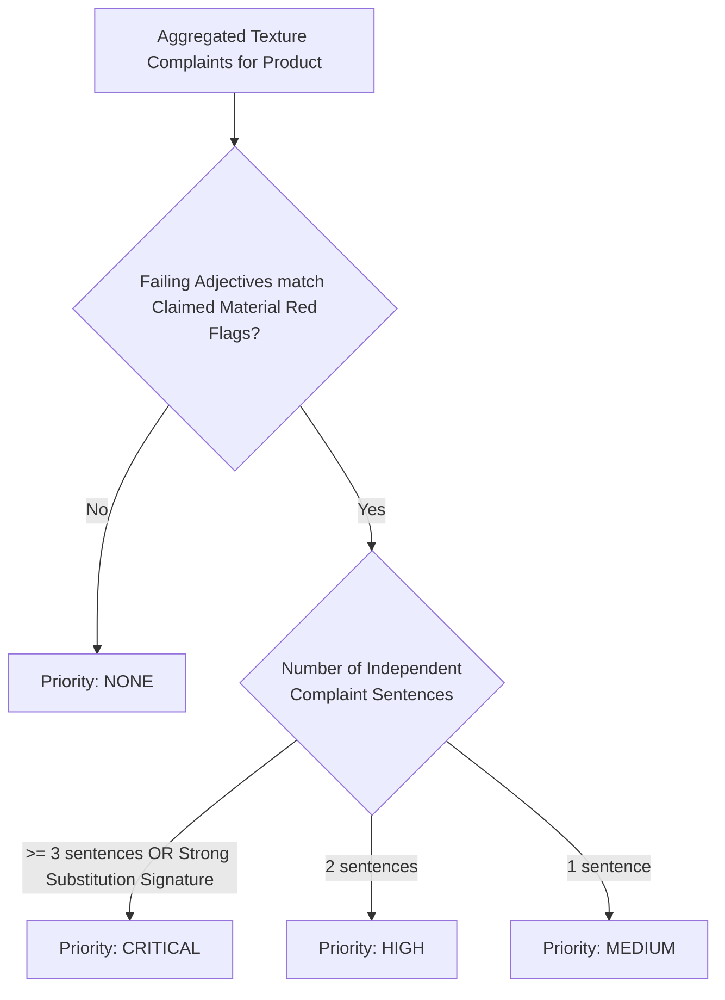

# 02. Data Ingestion & NLP Mismatch Pipeline

## Pipeline Topology & Data Ingestion

The offline analytical pipeline ingests real customer reviews and structured product catalog metadata to discover fabric discrepancies at marketplace scale.



---

## 1. Dataset Ingestion (`src/ingest/download_dataset.py`)

The pipeline pulls from the Amazon Reviews 2023 dataset (`McAuley-Lab/Amazon-Reviews-2023`), focusing on `raw_review_Clothing_Shoes_and_Jewelry` and matching metadata:
* **Product Sampling**: Filters for items with valid metadata (title, category, bullet features, structured detail specifications like `"Fabric Type"` or `"Material"`).
* **Review Collation**: Pairs every product (`parent_asin`) with its associated review texts, ratings, and customer feedback.
* **Volume Scalability**: Supports sample sizes from 100 to 50,000+ items without memory explosion by streaming records directly to local JSONL files (`data/raw/`).

---

## 2. Semantic Sentence Filtering (`src/nlp/semantic_filter.py`)

Customer reviews are mostly filled with logistics complaints ("fast delivery"), sizing complaints ("runs small"), or aesthetic remarks ("nice color"). Extracting purely **tactile & texture** sentences requires a high-precision semantic filter.

### Vector Representation & Seed Prototypes
Using `sentence-transformers/all-MiniLM-L6-v2` (384-dimensional embeddings), candidate sentences are compared against a curated set of **Fabric Tactile Prototype Anchors**:

```python
TEXTURE_SEEDS = [
    "the fabric feels soft and breathable",
    "the material is scratchy, rough, and cheap",
    "this feels like cheap synthetic plastic",
    "the weave is stiff, thick, and heavy",
    "the cloth is sheer, thin, and see-through",
    "it traps heat and makes you sweat",
    "feels silky, smooth, and lightweight",
    "it pilled and shrank after washing",
]
```

For each sentence $s$ with embedding $e_s$, its texture relevance score $R(s)$ is:
$$R(s) = \max_{p \in \text{Seeds}} \left( \frac{e_s \cdot e_p}{\|e_s\| \|e_p\|} \right)$$

### Empirical Threshold Calibration (`scripts/calibrate_threshold.py`)
During Phase 1 testing on 48,000 candidate sentences:
* At threshold $0.45$: Precision was only **~50%** (captured generic statements like *"the product looks nice and fits well"*).
* At threshold $0.50$: Precision reached **~90%**, isolating strictly tactile, thermal, and weave-related sentences while maintaining high recall on actual defect reports.

---

## 3. Negation & Contrastive Clause Parsing (`src/diagnosis/negation.py`)

A naive keyword search for red-flag adjectives (e.g. `scratchy`, `plastic`, `rough`) produces massive false-positive rates due to negative and contrastive constructions:
* *"It is **not scratchy at all**, very comfortable!"* $\to$ (Naive match = Defect; Correct = Praise)
* *"I was afraid it would feel like **plastic**, but it's pure cotton."* $\to$ (Naive match = Defect; Correct = Praise)
* *"Not soft, definitely **plasticky**."* $\to$ (Correct = Defect)



### Technical Implementation
* **Negation Scope Window**: Analyzes a sliding window of $\le 3$ tokens preceding the target adjective for negative modifiers (`not`, `no`, `never`, `hardly`, `scarcely`, `barely`, `without`, `isn't`, `wasn't`, `doesn't`).
* **Diminisher Handling**: Detects phrases like *"not at all scratchy"* or *"far from rough"*.
* **Suppression Accounting**: Every suppressed sentence is recorded in `negated_suppressed` metadata, providing complete visibility into filter decisions.

---

## 4. Grounded Mismatch Diagnosis Engine (`src/diagnosis/diagnose.py`)

Once valid texture complaints are harvested, the diagnosis engine cross-references them with the **Fabric Physics Ontology** ([`data/fabric_physics.json`](file:///d:/Downloads/projects/True-texture%20detector%20AI%20system/data/fabric_physics.json)).

### Priority Determination Matrix



### Substitution Signature Corroboration
If a product claims **Cotton** or **Silk**, but reviews contain complaints like `plastic`, `slick`, `shiny`, `sweaty`, `clingy`, or `staticky`:
1. The engine checks the `substitution_signature` in `fabric_physics.json`.
2. It detects that these symptoms precisely match **Polyester** masquerading as natural fiber.
3. It emits a structured `substitution_hypothesis`:
   ```json
   {
     "claimed_fiber": "cotton",
     "suspected_fiber": "polyester",
     "confidence": 0.88,
     "signature_matches": ["plastic", "sweaty", "slick"]
   }
   ```
4. This hypothesis is recorded in `data/processed/diagnosis.jsonl` and directly informs the Returns Concierge when a customer initiates a return.
