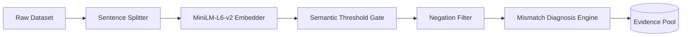
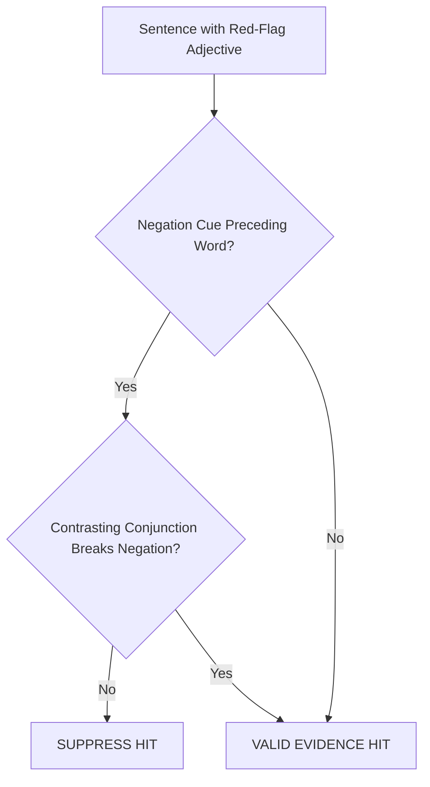
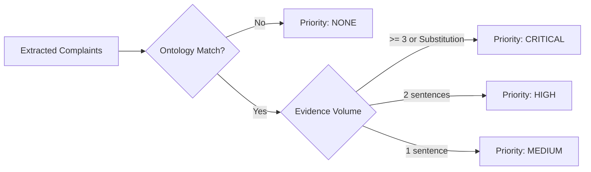

# 02. Data Ingestion & NLP Mismatch Pipeline

## Pipeline Topology & Data Ingestion

The offline analytical pipeline ingests real customer reviews and structured product catalog metadata to discover fabric discrepancies at marketplace scale.



#### Pipeline Stage Breakdown
* **Raw Dataset**: Ingests Amazon Reviews 2023 (`McAuley-Lab/Amazon-Reviews-2023`) focusing on apparel metadata and reviews.
* **Sentence Splitter**: Segments review blobs into clean, normalized sentence tokens.
* **MiniLM-L6-v2 Embedder**: Projects sentences into 384-dimensional dense vectors using `sentence-transformers`.
* **Semantic Threshold Gate**: Applies a calibrated cosine similarity threshold ($\ge 0.50$) against tactile seed prototypes.
* **Negation Filter**: Discards false-positive praise sentences (e.g., *"not scratchy"*).
* **Mismatch Diagnosis Engine**: Cross-references verified complaints with claimed materials in the ontology.
* **Evidence Pool**: Stores structured outputs in `texture_sentences.jsonl` and `diagnosis.jsonl`.

---

## 1. Semantic Sentence Filtering (`src/nlp/semantic_filter.py`)

Customer reviews are mostly filled with logistics complaints ("fast delivery"), sizing complaints ("runs small"), or aesthetic remarks ("nice color"). Extracting purely **tactile & texture** sentences requires a high-precision semantic filter.

### Vector Representation & Seed Prototypes
Candidate sentences are compared against a curated set of **Fabric Tactile Prototype Anchors**:

```python
TEXTURE_SEEDS = [
    "the fabric feels soft and breathable",
    "the material is scratchy, rough, and cheap",
    "this feels like cheap synthetic plastic",
    "the weave is stiff, thick, and heavy",
    "the cloth is sheer, thin, and see-through",
    "it traps heat and makes you sweat",
    "feels silky, smooth, and lightweight",
    "it pilled and shrank after washing",
]
```

For each sentence $s$ with embedding $e_s$, its texture relevance score $R(s)$ is:
$$R(s) = \max_{p \in \text{Seeds}} \left( \frac{e_s \cdot e_p}{\|e_s\| \|e_p\|} \right)$$

### Empirical Threshold Calibration (`scripts/calibrate_threshold.py`)
* At threshold $0.45$: Precision was only **~50%** (captured generic statements like *"looks nice and fits well"*).
* At threshold $0.50$: Precision reached **~90%**, isolating strictly tactile, thermal, and weave-related sentences while maintaining high recall on actual defect reports.

---

## 2. Negation & Contrastive Clause Parsing (`src/diagnosis/negation.py`)

A naive keyword search for red-flag adjectives (e.g. `scratchy`, `plastic`, `rough`) produces massive false-positive rates due to negative and contrastive constructions.



#### Negation Handling Details
* **Negation Cue Detection**: Scans a window of $\le 3$ preceding tokens for negation cues (`not`, `no`, `never`, `hardly`, `barely`, `scarcely`, `without`, `isn't`, `wasn't`).
* **Contrastive Scope Breaking**: Detects conjunctions like `but`, `however`, `although` (e.g., *"not soft, but definitely **scratchy**"* $\to$ keeps `scratchy` as a valid hit).
* **Metric Tracking**: Records all pruned hits in `negated_suppressed` for dashboard auditability.

---

## 3. Grounded Mismatch Diagnosis Engine (`src/diagnosis/diagnose.py`)

Once valid texture complaints are harvested, the diagnosis engine cross-references them with the **Fabric Physics Ontology** ([`data/fabric_physics.json`](file:///d:/Downloads/projects/True-texture%20detector%20AI%20system/data/fabric_physics.json)).



#### Diagnostic Priority Rules
* **Priority CRITICAL**: $\ge 3$ verified complaint sentences OR complaints matching a known synthetic substitution signature (e.g., Polyester masquerading as Silk).
* **Priority HIGH**: 2 independent customer complaint sentences matching ontology red flags.
* **Priority MEDIUM**: 1 verified customer complaint sentence matching ontology red flags.
* **Priority NONE**: Complaints do not contradict the claimed material's physical properties.
