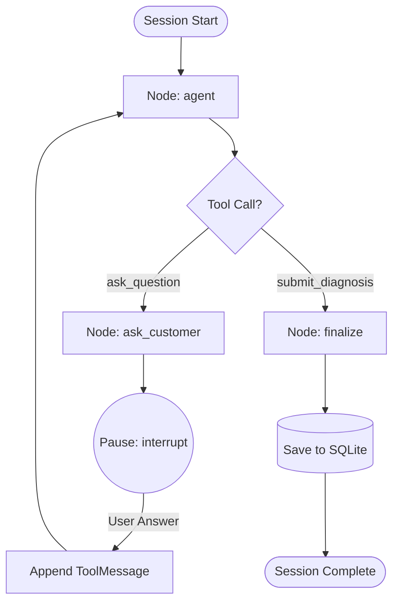

# 03. Conversational Returns Concierge (LangGraph)

## Architecture of the Returns Concierge

The **Returns Concierge** ([`src/concierge/graph.py`](file:///d:/Downloads/projects/True-texture%20detector%20AI%20system/src/concierge/graph.py)) is an autonomous conversational agent built using **LangGraph** (StateGraph). Its primary business objective is to conduct a targeted diagnostic interview when a customer initiates a return, discovering the exact tactile or thermal root cause in **at most 3 questions**.



#### LangGraph Execution Mechanics
* **`agent` Node**: Invokes the foundation model with dynamically bound tools (`ask_question`, `submit_diagnosis`). Enforces `submit_diagnosis` when question budget is exhausted.
* **`ask_customer` Node**: Extracts question text/options and invokes LangGraph `interrupt()`, suspending graph execution and returning the question payload to the frontend.
* **`ResumeState`**: Invoked via `ConciergeSession.answer(text)`. Resumes the paused thread with the customer's answer formatted as a `ToolMessage`.
* **`finalize` Node**: Intercepts `submit_diagnosis`, enriches the payload with ground-truth ontology facts, and commits the session to SQLite.

---

## 1. LangGraph State Definition & Tool Control

The agent state is modeled as a strongly typed dictionary subclass:

```python
class ConciergeState(dict):
    """Typed state for the concierge graph."""

ConciergeState.__annotations__ = {
    "messages": Annotated[list[BaseMessage], add_messages],  # Appends deltas
    "questions_asked": int,                                  # Hard budget counter
    "transcript": list[dict],                                # Audit log of dialog
    "result": dict,                                          # Final enriched diagnosis
}
```

### Deterministic Tool Narrowing
1. **Questions Remaining ($< 3$)**: Both `ask_question` and `submit_diagnosis` are available.
2. **Budget Reached ($\ge 3$)**: Only `submit_diagnosis` is bound (`tool_choice="required"`), guaranteeing deterministic termination without infinite conversation loops.

---

## 2. Tool Interfaces & Contract

The agent communicates exclusively through two structured Pydantic tools ([`src/concierge/tools.py`](file:///d:/Downloads/projects/True-texture%20detector%20AI%20system/src/concierge/tools.py)):

### Tool 1: `ask_question`
```python
class AskQuestionInput(BaseModel):
    question: str = Field(description="The concrete question to ask the customer.")
    options: list[str] = Field(
        description="2-4 neutral, mutually exclusive options. MUST include genuine feel.",
        min_length=2, max_length=4
    )
```

### Tool 2: `submit_diagnosis`
```python
class SubmitDiagnosisInput(BaseModel):
    reported_feel: str = Field(description="Customer's reported tactile sensation.")
    material_issue_suspected: bool = Field(description="True if texture contradicts genuine claimed material.")
    suspected_substitution: Optional[str] = Field(description="polyester, viscose_rayon, acrylic, or None.")
    weather_context: Optional[str] = Field(description="Weather/activity during wear.")
    weather_suitability_mismatch: Optional[bool] = Field(description="True if worn outside combined ideal weather.")
    root_cause: Literal["TEXTURE_MISMATCH", "THERMAL_DISCOMFORT", "WRONG_SIZE_FIT", "AESTHETIC_PREFERENCE", "BUYER_REMORSE"]
    seller_action: Literal["SUPPLY_CHAIN_AUDIT", "QUALITY_IMPROVEMENT", "LISTING_FIX", "NO_ACTION"]
    listing_fix_recommendation: Optional[str] = Field(description="Specific actionable fix for seller.")
    customer_closing_message: str = Field(description="Empathetic, non-blaming resolution message.")
    confidence: Literal["HIGH", "MEDIUM", "LOW"]
```

---

## 3. Dynamic Context Engineering & KV Caching

To achieve maximum inference performance and lower token cost, the agent's prompts are decoupled into **Static Invariant Instructions** and **Dynamic Runtime Context**:

```python
# 1. Pure static system prompt — 100% cacheable across all products and users
def build_system_prompt() -> str:
    return (
        "You are a returns assistant for a fashion marketplace.\n\n"
        + _skill_policy()
    )

# 2. Dynamic context engineered payload for the initial user turn
def build_case_context(product: dict, ontology: FabricOntology,
                       diagnosis_row: dict | None, category: str | None = None) -> str:
    claimed, weaves, prior_block = resolve_materials(product, ontology, category)
    ontology_lines = [_ontology_line(m, ontology) for m in claimed]
    weave_lines = [_weave_line(w, ontology) for w in weaves]
    ...
    return f"""<case_context>
  <product title="{(product.get('title') or '')[:140]}" listed_materials="{', '.join(claimed) or 'not stated'}" />
  <fabric_ontology>
    {chr(10).join(ontology_lines) or 'None'}
  </fabric_ontology>
  <weave_construction>
    {chr(10).join(weave_lines) or 'None'}
  </weave_construction>
  <prior_evidence>{evidence_block}</prior_evidence>
</case_context>

The customer just clicked 'Return item'. Begin the interview."""
```

### Initial State Initialization
```python
def start(self) -> dict:
    initial_state = {
        "messages": [
            SystemMessage(content=self._system),      # Static cached policy
            HumanMessage(content=self._case_context), # Context-engineered payload
        ],
        "questions_asked": 0,
        "transcript": [],
        "result": {},
    }
    return self._run(initial_state)
```

---

## 4. LLM Gateway & Portkey AI Integration

Model invocation is routed through [`src/concierge/portkey_llm.py`](file:///d:/Downloads/projects/True-texture%20detector%20AI%20system/src/concierge/portkey_llm.py):
* **Portkey Gateway**: Centralized routing, automatic retries, and fallback across OpenAI, Anthropic, Gemini, Groq, and AWS Bedrock.
* **Mock Provider (`src/concierge/mock_chat.py`)**: Built-in deterministic conversational simulator for local testing with zero API cost and instant response times.
