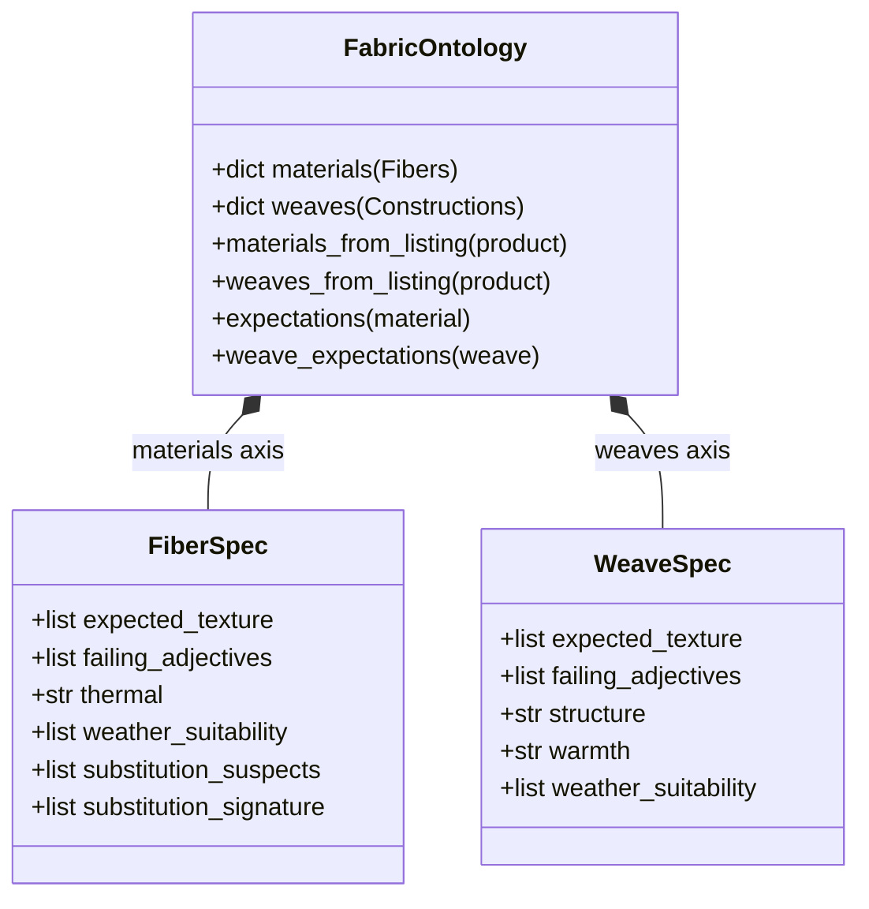
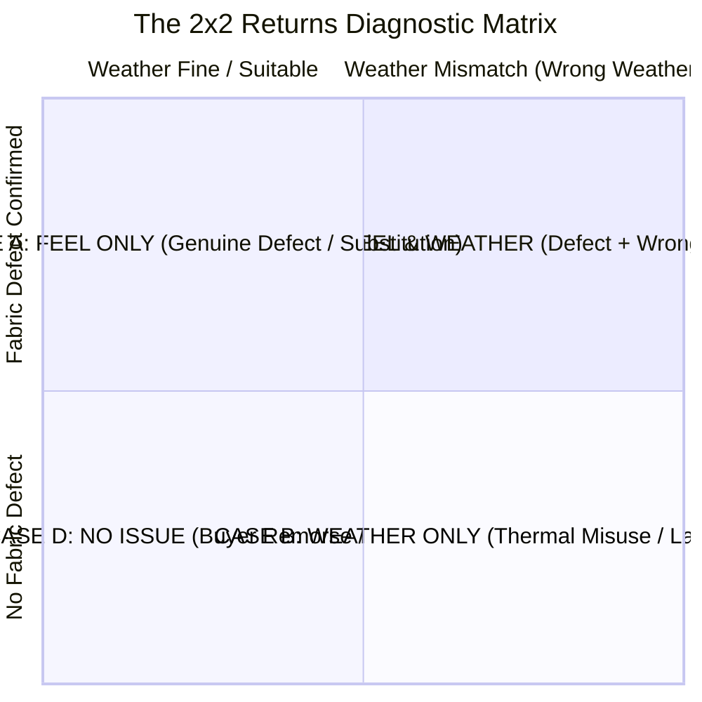

# 04. Fabric Physics Ontology & 2×2 Decision Engine

## Two Orthogonal Physical Dimensions

Human tactile and thermal experience in clothing is governed by **two independent axes**:
1. **Material Fiber (What it's made of)**: Determines chemical breathability, moisture absorption, natural softness, and synthetic substitution risk.
2. **Weave & Construction (How it's made)**: Determines physical surface structure (smooth, ribbed, crinkled, sheer) and thermal air-trapping (pile, brushed, open knit).



---

## 1. Fabric Physics Schema ([`data/fabric_physics.json`](file:///d:/Downloads/projects/True-texture%20detector%20AI%20system/data/fabric_physics.json))

### A. Fiber Layer (`materials`)
Governs chemical properties, genuine feel, and cheap substitutions:

```json
"cotton": {
  "aliases": ["100% cotton", "pima", "supima", "organic cotton", "khadi"],
  "expected_texture": ["soft", "matte", "breathable", "absorbent", "natural"],
  "failing_adjectives": ["plastic", "shiny", "slick", "sweaty", "clingy", "staticky", "suffocating", "rough", "scratchy", "coarse"],
  "thermal": "high_breathability",
  "weather_suitability": ["hot", "humid", "dry", "mild"],
  "typical_gsm": [120, 220],
  "substitution_suspects": ["polyester"]
}
```

### B. Weave Layer (`weaves`)
Governs surface tactile mechanics and thermal construction overrides:

```json
"corduroy": {
  "aliases": ["cord"],
  "expected_texture": ["ribbed", "soft", "thick", "plush-wale", "warm"],
  "failing_adjectives": ["flat", "thin", "stiff", "scratchy"],
  "structure": "pile",
  "warmth": "warm",
  "weather_suitability": ["cold", "cool"]
}
```

> [!IMPORTANT]
> **Construction Dominates Warmth**: As noted in the ontology specification, raised pile weaves (corduroy, fleece, velvet) trap dead air and create warmth for cold weather even when made from breathable fibers like cotton. Open weaves (mesh, net, organza) ventilate for hot weather. The weather suitability of the weave combines with and overrides the fiber's default.

---

## 2. Category Prior Resolution & Normalization

In fashion ecommerce, approximately **60% of product listings fail to declare explicit material composition** in structured fields.

To solve this cold-start problem, the system employs **Category Priors** ([`data/category_materials.json`](file:///d:/Downloads/projects/True-texture%20detector%20AI%20system/data/category_materials.json) and [`src/physics/category_materials.py`](file:///d:/Downloads/projects/True-texture%20detector%20AI%20system/src/physics/category_materials.py)):

```mermaid
flowchart LR
    A[Product Listing with Missing Fiber] --> B[Identify Category <br/> e.g. 'Men's Trousers']
    B --> C[Fetch Priors via likely_materials <br/> ['cotton', 'poly-cotton', 'linen', 'corduroy']]
    C --> D[normalize_to_ontology]
    D --> E[Fibers: 'cotton', 'polyester', 'linen']
    D --> F[Weaves: 'corduroy']
    E --> G[Inject as Probable Material Expectations]
    F --> G
```

* `likely_materials(category, department)`: Queries catalog priors for the category.
* `normalize_to_ontology(material)`: Maps blended strings (e.g. `"poly-cotton"`, `"art silk"`, `"chambray"`, `"corduroy"`) into their canonical fiber keys in the ontology.

---

## 3. The Deterministic 2×2 Diagnostic Response Matrix

A core design decision of the True-Texture platform is that **seller remediation tickets and customer resolutions are never left to free-form LLM hallucination**.

The classification is computed deterministically in [`classify_case()`](file:///d:/Downloads/projects/True-texture%20detector%20AI%20system/src/concierge/concierge.py#L35-L44):

$$\text{Case Class} = f(\text{material\_issue\_suspected}, \text{weather\_suitability\_mismatch})$$



| Quadrant | Physical Reality | Customer Experience | Seller Action | Root Cause |
| :--- | :--- | :--- | :--- | :--- |
| **CASE A: FEEL_ONLY** | Fabric defect / cheap synthetic substitute; worn in correct weather. | Empathetic apology; feedback routed to quality team. No weather mention. | `SUPPLY_CHAIN_AUDIT` (if substitution) or `QUALITY_IMPROVEMENT` | `TEXTURE_MISMATCH` |
| **CASE B: WEATHER_ONLY** | Product matches genuine fiber claims, but customer wore it in wrong climate (e.g. wearing thick fleece in hot humidity). | Warm educational guidance on ideal weather + intuitive styling/layering tips. | `LISTING_FIX` (clarify seasonal suitability in listing) or `NO_ACTION` | `THERMAL_DISCOMFORT` |
| **CASE C: FEEL_AND_WEATHER** | Both a material defect AND worn in wrong climate. | Apology regarding material feel + seasonal weather profile guidance. | `SUPPLY_CHAIN_AUDIT` / `QUALITY_IMPROVEMENT` | `TEXTURE_MISMATCH` |
| **CASE D: NO_ISSUE** | Product is physically sound; return is due to sizing, aesthetics, or buyer remorse. | Polite acknowledgment; feedback logged. | `NO_ACTION` on isolated returns (escalates only on bulk trends) | `BUYER_REMORSE` / `WRONG_SIZE_FIT` |

---

## 4. Ground Truth Enrichment Engine (`enrich_diagnosis`)

Before storing any diagnosis in the database, [`enrich_diagnosis()`](file:///d:/Downloads/projects/True-texture%20detector%20AI%20system/src/concierge/concierge.py#L137-L168) deterministically attaches the ground truth facts from the ontology:

```python
def enrich_diagnosis(payload, ontology, claimed_materials, weaves):
    return {
        **payload,
        "case_class": classify_case(
            payload.get("material_issue_suspected"),
            payload.get("weather_suitability_mismatch")
        ),
        "claimed_materials": claimed_materials,
        "material_ground_truth": [
            {
                "material": m,
                "genuine_feel": spec.get("expected_texture", []),
                "thermal": spec.get("thermal"),
                "ideal_weather": spec.get("weather_suitability", []),
                "common_substitutes": spec.get("substitution_suspects", [])
            }
            for m in claimed_materials if (spec := ontology.expectations(m))
        ],
        "weaves": weaves,
        "weave_ground_truth": [
            {
                "weave": w,
                "should_feel": spec.get("expected_texture", []),
                "feels_wrong_if": spec.get("failing_adjectives", []),
                "warmth": spec.get("warmth")
            }
            for w in weaves if (spec := ontology.weave_expectations(w))
        ],
    }
```
This guarantees that marketplace sellers receive verified physical specifications alongside every customer complaint.
