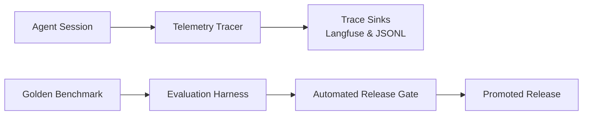
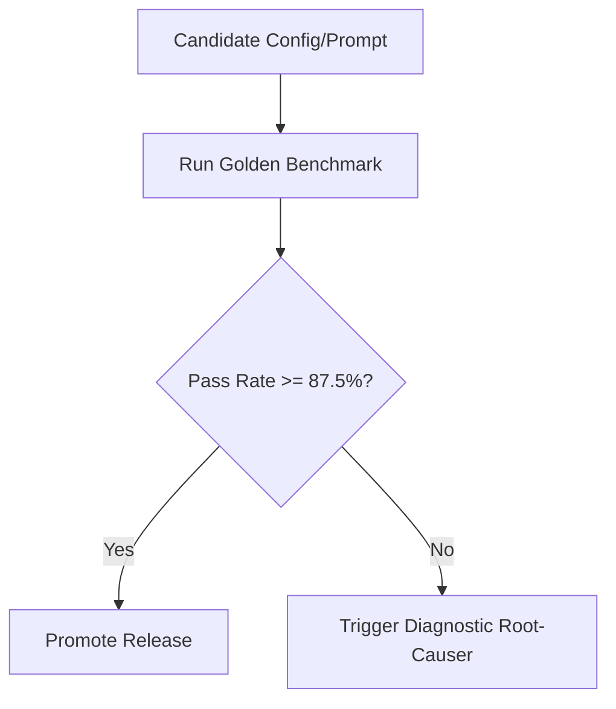

# 05. LLMOps, Observability & Evaluation Harness

## The LLMOps Continuous Improvement Loop

To prevent model regressions, prompt drift, and silent failures in production, True-Texture includes an integrated **LLMOps and Evaluation Framework** ([`src/llmops/`](file:///d:/Downloads/projects/True-texture%20detector%20AI%20system/src/llmops/)).

#### LLMOps Loop Components
* **Telemetry Tracer**: `TracingCallbackHandler` hooks into LangGraph invocations to log generation events, token counts, and tool calls.
* **Trace Sinks**: Dual telemetry destinations (OpenTelemetry stream to Langfuse Cloud + local append-only `traces.jsonl`).
* **Golden Benchmark**: 8 grounded scenarios covering all quadrants of the 2×2 response matrix.
* **Evaluation Harness**: Multi-dimensional scoring evaluating convergence, case classification, and red-flag extraction.
* **Automated Release Gate**: Evaluates candidate prompts/models against a $\ge 87.5\%$ threshold before promoting to `releases.json`.

---

## 1. Tracing & Telemetry Architecture (`src/llmops/tracer.py`)

Every interaction through the Returns Concierge is instrumented as a hierarchical execution trace:

* **`RunTrace`**: Captures session-level metadata (`run_id`, `started_at`, `scenario`, `model_id`, `provider`, `cost_usd`, `converged`, `questions_asked`).
* **Generation Events**: Each LLM invocation records `latency_ms`, `tokens_in`, `tokens_out`, `used_tools`, and `stop_reason`.
* **Dual-Sink Exporter**:
  * **Local Offline**: Appends structured JSON lines to [`data/processed/traces.jsonl`](file:///d:/Downloads/projects/True-texture%20detector%20AI%20system/data/processed/traces.jsonl).
  * **Cloud OpenTelemetry**: When `LANGFUSE_PUBLIC_KEY` and `LANGFUSE_SECRET_KEY` are provided in `.env`, traces stream in real-time to the **Langfuse** platform for centralized dashboarding and latency analysis.

---

## 2. The Golden Evaluation Benchmark (`src/llmops/evaluate.py`)

Evaluating conversational agents with unstructured outputs requires a deterministic ground truth test suite. The platform includes a **Golden Benchmark of 8 Grounded Scenarios** covering every operational quadrant:

| Scenario Key | Claimed Material | Customer Experience | Expected Case | Expected Root Cause |
| :--- | :--- | :--- | :--- | :--- |
| `cotton_poly_substitution` | Cotton shirt | *"Slick, shiny, and made me sweat instantly"* | `CASE_FEEL_ONLY` (A) | `TEXTURE_MISMATCH` |
| `silk_saree_scratchy` | Silk saree | *"Coarse, stiff, and scratchy on skin"* | `CASE_FEEL_ONLY` (A) | `TEXTURE_MISMATCH` |
| `wool_sweater_acrylic` | Wool sweater | *"Felt squeaky and plasticky, high static"* | `CASE_FEEL_ONLY` (A) | `TEXTURE_MISMATCH` |
| `fleece_jacket_summer` | Fleece jacket | *"Extremely hot and sweaty during summer jog"* | `CASE_WEATHER_ONLY` (B) | `THERMAL_DISCOMFORT` |
| `linen_shirt_winter` | Linen shirt | *"Freezing cold in heavy winter weather"* | `CASE_WEATHER_ONLY` (B) | `THERMAL_DISCOMFORT` |
| `velvet_dress_defect_summer`| Velvet dress | *"Scratchy thin fabric, also suffocating in heat"* | `CASE_FEEL_AND_WEATHER` (C)| `TEXTURE_MISMATCH` |
| `cashmere_size_large` | Cashmere cardigan| *"Fabric is wonderfully soft, but runs huge"* | `CASE_NO_ISSUE` (D) | `WRONG_SIZE_FIT` |
| `satin_color_preference` | Satin gown | *"Lovely glossy fabric, but color looks pale"* | `CASE_NO_ISSUE` (D) | `AESTHETIC_PREFERENCE`|

---

## 3. Evaluation Metrics & Scoring Matrix

For each scenario run, the evaluation harness calculates:

1. **Convergence Rate ($\mathcal{M}_{\text{conv}}$)**: Did the agent finalize the interview within $\le 3$ questions and emit a valid `SubmitDiagnosisInput` payload?
2. **Case Classification Accuracy ($\mathcal{M}_{\text{case}}$)**: Did the computed `case_class` match the ground truth quadrant?
3. **Red-Flag Extraction Precision ($\mathcal{M}_{\text{flag}}$)**: Did the diagnosis capture the specific tactile red flags (e.g. `["slick", "sweaty", "shiny"]`)?
4. **Weather Mismatch Precision ($\mathcal{M}_{\text{weather}}$)**: Was `weather_suitability_mismatch` correctly identified?
5. **Latency & Token Efficiency**: Average latency per turn ($< 1500\text{ms}$) and total cost per return ($< \$0.005$).

$$\text{Pass Score} = \frac{1}{N} \sum_{i=1}^{N} \mathbb{I}(\text{Case Match}_i \land \text{Converged}_i)$$

---

## 4. Automated Release Gate & Promotion (`src/llmops/gate.py` & `src/llmops/config.py`)

A release gate script prevents regressions from entering production:

#### Release Gate Stages
1. **Benchmark Execution**: `scripts/run_llmops.py` runs all 8 golden cases against the candidate model and `skill.md`.
2. **Threshold Verification**: Requires $\ge 7/8$ ($87.5\%$) pass rate across all evaluated dimensions.
3. **Version Promotion**: Computes the SHA-256 hash of `skill.md` and appends the blessed configuration to `releases.json`.
4. **Regression Diagnosis**: If the gate fails, `src/llmops/diagnose.py` isolates whether the regression was caused by prompt drift, tool binding issues, or classification errors.
