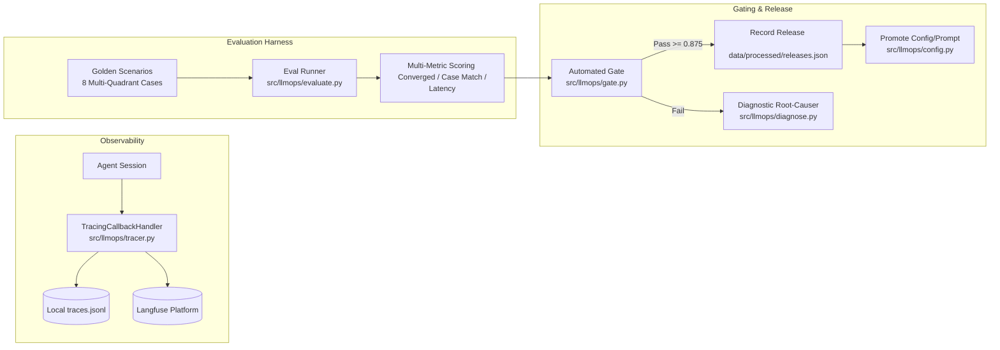

# 05. LLMOps, Observability & Evaluation Harness

## The LLMOps Continuous Improvement Loop

To prevent model regressions, prompt drift, and silent failures in production, True-Texture includes an integrated **LLMOps and Evaluation Framework** ([`src/llmops/`](file:///d:/Downloads/projects/True-texture%20detector%20AI%20system/src/llmops/)).



---

## 1. Tracing & Telemetry Architecture (`src/llmops/tracer.py`)

Every interaction through the Returns Concierge is instrumented as a hierarchical execution trace:

* **`RunTrace`**: Captures session-level metadata (`run_id`, `started_at`, `scenario`, `model_id`, `provider`, `cost_usd`, `converged`, `questions_asked`).
* **Generation Events**: Each LLM invocation records `latency_ms`, `tokens_in`, `tokens_out`, `used_tools`, and `stop_reason`.
* **Dual-Sink Exporter**:
  * **Local Offline**: Appends structured JSON lines to [`data/processed/traces.jsonl`](file:///d:/Downloads/projects/True-texture%20detector%20AI%20system/data/processed/traces.jsonl).
  * **Cloud OpenTelemetry**: When `LANGFUSE_PUBLIC_KEY` and `LANGFUSE_SECRET_KEY` are provided in `.env`, traces stream in real-time to the **Langfuse** platform for centralized dashboarding and latency analysis.

```python
class TracingCallbackHandler(BaseCallbackHandler):
    """Hooks into LangChain/LangGraph callback pipeline."""
    def on_llm_end(self, response: LLMResult, **kwargs: Any) -> None:
        # Calculates latency, token usage, tool calls, and records generation event
```

---

## 2. The Golden Evaluation Benchmark (`src/llmops/evaluate.py`)

Evaluating conversational agents with unstructured outputs requires a deterministic ground truth test suite. The platform includes a **Golden Benchmark of 8 Grounded Scenarios** covering every operational quadrant:

| Scenario Key | Claimed Material | Customer Experience | Expected Case | Expected Root Cause |
| :--- | :--- | :--- | :--- | :--- |
| `cotton_poly_substitution` | Cotton shirt | *"Slick, shiny, and made me sweat instantly"* | `CASE_FEEL_ONLY` (A) | `TEXTURE_MISMATCH` |
| `silk_saree_scratchy` | Silk saree | *"Coarse, stiff, and scratchy on skin"* | `CASE_FEEL_ONLY` (A) | `TEXTURE_MISMATCH` |
| `wool_sweater_acrylic` | Wool sweater | *"Felt squeaky and plasticky, high static"* | `CASE_FEEL_ONLY` (A) | `TEXTURE_MISMATCH` |
| `fleece_jacket_summer` | Fleece jacket | *"Extremely hot and sweaty during summer jog"* | `CASE_WEATHER_ONLY` (B) | `THERMAL_DISCOMFORT` |
| `linen_shirt_winter` | Linen shirt | *"Freezing cold in heavy winter weather"* | `CASE_WEATHER_ONLY` (B) | `THERMAL_DISCOMFORT` |
| `velvet_dress_defect_summer`| Velvet dress | *"Scratchy thin fabric, also suffocating in heat"* | `CASE_FEEL_AND_WEATHER` (C)| `TEXTURE_MISMATCH` |
| `cashmere_size_large` | Cashmere cardigan| *"Fabric is wonderfully soft, but runs huge"* | `CASE_NO_ISSUE` (D) | `WRONG_SIZE_FIT` |
| `satin_color_preference` | Satin gown | *"Lovely glossy fabric, but color looks pale"* | `CASE_NO_ISSUE` (D) | `AESTHETIC_PREFERENCE`|

---

## 3. Evaluation Metrics & Scoring Matrix

For each scenario run, the evaluation harness calculates:

1. **Convergence Rate ($\mathcal{M}_{\text{conv}}$)**: Did the agent finalize the interview within $\le 3$ questions and emit a valid `SubmitDiagnosisInput` payload?
2. **Case Classification Accuracy ($\mathcal{M}_{\text{case}}$)**: Did the computed `case_class` match the ground truth quadrant (`CASE_FEEL_ONLY`, `CASE_WEATHER_ONLY`, `CASE_FEEL_AND_WEATHER`, `CASE_NO_ISSUE`)?
3. **Red-Flag Extraction Precision ($\mathcal{M}_{\text{flag}}$)**: Did the diagnosis capture the specific tactile red flags (e.g. `["slick", "sweaty", "shiny"]`)?
4. **Weather Mismatch Precision ($\mathcal{M}_{\text{weather}}$)**: Was `weather_suitability_mismatch` correctly identified?
5. **Latency & Token Efficiency**: Average latency per turn ($< 1500\text{ms}$) and total cost per return ($< \$0.005$).

$$\text{Pass Score} = \frac{1}{N} \sum_{i=1}^{N} \mathbb{I}(\text{Case Match}_i \land \text{Converged}_i)$$

---

## 4. Automated Release Gate & Promotion (`src/llmops/gate.py` & `src/llmops/config.py`)

A release gate script prevents regressions from entering production:

```mermaid
flowchart TD
    A[Trigger Release Run: scripts/run_llmops.py] --> B[Execute Golden Benchmark on Candidate Model/Prompt]
    B --> C[Compute Overall Pass Rate]
    C --> D{Pass Rate >= 87.5% (7/8)?}
    D -- Yes --> E[Compute SHA-256 Hash of skill.md]
    E --> F[Record Blessed Release in data/processed/releases.json]
    F --> G[Deploy to Production Concierge]
    D -- No --> H[Raise Gate Failure Alert]
    H --> I[Execute src/llmops/diagnose.py to pinpoint regression]
```

### Prompt Version Hashing
```python
def prompt_version() -> str:
    """Calculates SHA-256 hash of skill.md to track prompt lineage."""
    text = _SKILL_PATH.read_text(encoding="utf-8") if _SKILL_PATH.exists() else ""
    return hashlib.sha256(text.encode("utf-8")).hexdigest()[:8]
```
Every record in SQLite and Langfuse is tagged with the exact `prompt_version` hash, enabling root-cause regression debugging across prompt revisions.
