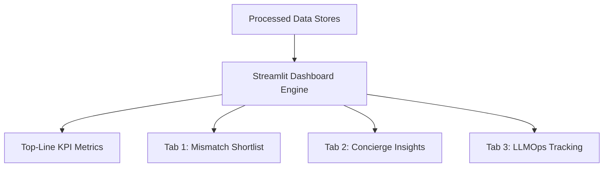
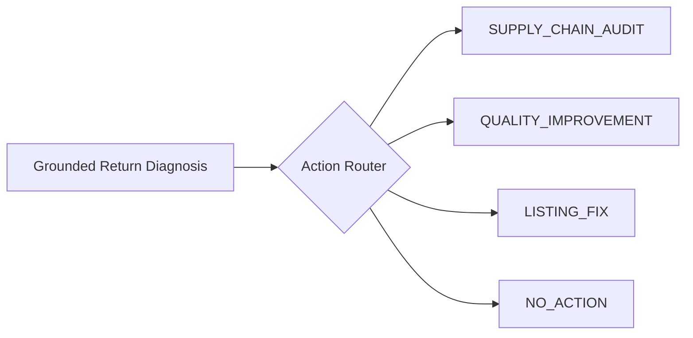

# 06. Seller Returns Intelligence Dashboard

## Portal Architecture & Value Proposition

The **Seller Intelligence Dashboard** ([`app.py`](file:///d:/Downloads/projects/True-texture%20detector%20AI%20system/app.py)) provides marketplace operations teams, brand managers, and sellers with real-time, evidence-grounded insights into fabric quality and return drivers.



#### Portal Subsystem Overview
* **Processed Data Stores**: Pulls from `diagnosis.jsonl` (mined batch data), `texture_sentences.jsonl` (evidence quotes), `insights.sqlite` (episodic chat transcripts), and `releases.json` (model versions).
* **Top-Line KPI Metrics**: Summarizes catalog volume, flagged items, extracted customer evidence sentences, and false-hit suppressions.
* **Tab 1 (Mismatch Shortlist)**: Actionable table prioritized by risk level with product drill-down inspectors.
* **Tab 2 (Concierge Insights)**: Multi-turn chat transcript viewer, case distribution charts, and seller tickets.
* **Tab 3 (LLMOps Tracking)**: Benchmark regression history, latency metrics, and prompt hash lineage.

---

## 1. Top-Level Executive KPI Row

The header bar provides immediate visibility into marketplace health:
* **Garments Analyzed**: Total apparel catalog volume processed through the NLP pipeline.
* **Flagged for Action**: Count of products crossing the mismatch threshold (`CRITICAL`, `HIGH`, `MEDIUM`).
* **Texture Evidence Sentences**: Number of raw customer quotes validated by semantic and negation filtering.
* **Negation False-Hits Suppressed**: Transparency metric showing how many misleading praise comments (e.g. *"not scratchy"*) were pruned from false flagging.
* **Concierge Sessions**: Active return conversations held in the episodic store.

---

## 2. Dashboard Modules & Workflows

### Tab 1: Mismatch Shortlist & Evidence Drill-Down
Provides a prioritized table of high-risk items requiring immediate catalog or supplier intervention.

```
┌────────────────────────────────────────────────────────────────────────────────────────┐
│ Filter by Priority: [x] CRITICAL  [x] HIGH  [x] MEDIUM                                  │
├──────────┬─────────────────────────────────────┬───────────┬──────────────┬────────────┤
│ Priority │ Product Title                       │ Claims    │ Complaints   │ Evidence # │
├──────────┼─────────────────────────────────────┼───────────┼──────────────┼────────────┤
│ CRITICAL │ Men's Slim Fit Cotton Henley        │ cotton    │ plastic, hot │ 14 quotes  │
│ HIGH     │ Women's Silk Saree with Blouse Piece│ silk      │ scratchy     │ 6 quotes   │
│ MEDIUM   │ Boys Athletic Performance Fleece    │ fleece    │ thin, rough  │ 3 quotes   │
└──────────┴─────────────────────────────────────┴───────────┴──────────────┴────────────┘
```

#### Product Drill-Down Inspector
Selecting any flagged item renders a deep diagnostic card:
1. **Catalog Claims vs Ground Truth**: Displays listed fiber claims alongside physical expectations from `fabric_physics.json`.
2. **Substitution Suspect Warning**: If customer complaints match a synthetic signature (e.g. Polyester disguised as Cotton), a warning card highlights the exact synthetic substitute.
3. **Verbatim Customer Quotes**: Interactive list of real customer reviews that triggered the flag, complete with sentiment scores and timestamps.

---

### Tab 2: Concierge Return Insights (Episodic Memory Browser)
Allows operations leads to inspect real customer return conversations processed by the LangGraph agent:
* **2×2 Case Class Distribution**: Visual breakdown of `CASE_FEEL_ONLY`, `CASE_WEATHER_ONLY`, `CASE_FEEL_AND_WEATHER`, and `CASE_NO_ISSUE`.
* **Full Multi-Turn Transcripts**: Clickable accordion allowing engineers to inspect the exact questions the agent asked and how the customer responded.
* **Automated Action Tickets**: Displays the concrete recommendation generated by the agent (`SUPPLY_CHAIN_AUDIT`, `QUALITY_IMPROVEMENT`, `LISTING_FIX`).

---

### Tab 3: LLMOps Benchmark & Release Tracking
Displays the historical telemetry and regression gating history of the underlying conversational models:
* **Current Blessed Prompt**: Displays the SHA-256 hash and version of the active `skill.md` procedural memory.
* **Pass Rate vs Golden Benchmark**: Tracks historical accuracy across synthetic evaluation suites.
* **Latency & Token Cost**: Tracks average cost per return interaction ($0.001 to $0.004) across LLM providers.

---

## 3. Automated Seller Remediation Actions

When an issue is identified, the system classifies it into one of three structured business actions ([`src/concierge/seller_escalation.py`](file:///d:/Downloads/projects/True-texture%20detector%20AI%20system/src/concierge/seller_escalation.py)):



#### Remediation Action Specifications
1. **`SUPPLY_CHAIN_AUDIT`**:
   * *Trigger*: Strong polyester or acrylic substitution signature found on natural fiber listing.
   * *Remedy*: Seller is notified to verify fiber batches with their textile mill or re-label the listing as poly-blend.
2. **`QUALITY_IMPROVEMENT`**:
   * *Trigger*: Genuine fiber confirmed, but customer reports coarse, stiff, or scratchy feel.
   * *Remedy*: Recommends sourcing higher-grade long-staple cotton, combed yarns, or applying enzyme washing.
3. **`LISTING_FIX`**:
   * *Trigger*: Product is physically sound, but customer experienced thermal discomfort due to climate misuse.
   * *Remedy*: Automatically drafts listing bullet updates (e.g. *"Best suited for air-conditioned or mild 15°C–22°C weather"*).
4. **`NO_ACTION`**:
   * *Trigger*: Isolated single return for size/fit/buyer remorse.
   * *Remedy*: Logged to baseline monitoring; escalates to account review only if return rate exceeds platform threshold.
