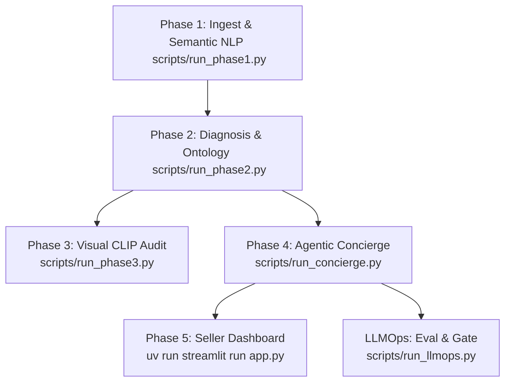

# 07. Developer Operations & Deployment Guide

## Prerequisites & Environment Setup

True-Texture uses **`uv`** as its fast Python package and project manager.

### 1. Toolchain Installation
Ensure Python 3.12+ and `uv` are installed:
```bash
# Install uv (macOS/Linux)
curl -LsSf https://astral.sh/uv/install.sh | sh

# Install uv (Windows PowerShell)
powershell -ExecutionPolicy ByPass -c "irm https://astral.sh/uv/install.ps1 | iex"
```

### 2. Repository Setup & Dependencies
Clone the repository and synchronize the virtual environment:
```bash
cd "True-texture detector AI system"
uv sync
```

### 3. Environment Variables Configuration (`.env`)
Create a `.env` file in the root directory:

```ini
# --- LLM Gateway & Orchestration (Portkey) ---
PORTKEY_API_KEY=your_portkey_api_key_here
PORTKEY_VIRTUAL_KEY=optional_virtual_key

# --- Direct Provider Fallbacks (Optional if using Portkey) ---
OPENAI_API_KEY=your_openai_key
ANTHROPIC_API_KEY=your_anthropic_key
GEMINI_API_KEY=your_gemini_key
GROQ_API_KEY=your_groq_key

# --- Observability & Telemetry (Langfuse) ---
LANGFUSE_PUBLIC_KEY=pk-lf-...
LANGFUSE_SECRET_KEY=sk-lf-...
LANGFUSE_HOST=https://cloud.langfuse.com
```

> [!NOTE]
> **Zero-Cost / Mock Mode**: If you do not have API keys configured, all scripts automatically support `--provider mock`, which runs the deterministic conversation simulator with zero network calls and $0 cost.

---

## Complete Pipeline Execution Workflow

The platform is partitioned into discrete, reproducible execution phases:



### Phase 1: Data Ingestion & Semantic Filtering
Samples reviews from the raw apparel dataset, performs sentence segmentation, computes MiniLM embeddings, and applies calibrated 0.50 thresholding:
```bash
uv run python scripts/run_phase1.py --sample-size 300
```
*Output*: `data/processed/texture_sentences.jsonl`

---

### Phase 2: Grounded Mismatch Diagnosis
Runs negation-aware pruning and matches extracted customer complaints against the fabric physics ontology:
```bash
uv run python scripts/run_phase2.py
```
*Output*: `data/processed/diagnosis.jsonl`

---

### Phase 3: Visual Corroboration (Optional Multimodal Audit)
Audits product catalog imagery against texture claims using zero-shot CLIP similarity:
```bash
uv run python scripts/run_phase3.py
```
*Output*: `data/processed/visual_audit.jsonl`

---

### Phase 4: Conversational Returns Concierge
Executes the LangGraph conversational concierge across sample return scenarios:
```bash
# Run batch simulation using mock provider ($0 cost)
uv run python scripts/run_concierge.py --provider mock --limit 10

# Run with a live LLM via Portkey (OpenAI / Anthropic / Gemini / Groq)
uv run python scripts/run_concierge.py --provider portkey --model gpt-4o-mini --limit 5
```
*Output*: `data/processed/insights.sqlite` and `data/processed/traces.jsonl`

---

### Phase 5: Launch the Streamlit Seller Dashboard
Starts the interactive seller returns intelligence dashboard:
```bash
uv run streamlit run app.py
```
Open your browser at `http://localhost:8501`.

---

## Evaluation, LLMOps & Testing CLI

### 1. Interactive Single-Session CLI Demo
To interactively chat with the Returns Concierge in your terminal:
```bash
uv run python scripts/demo.py --provider mock
```

### 2. Live Interactive Test with Real Models
```bash
uv run python scripts/test_live_concierge.py --provider groq --model llama-3.3-70b-versatile
```

### 3. Run LLMOps Golden Benchmark & Release Gate
Executes the 8-scenario evaluation suite, calculates pass rates, and records candidate releases:
```bash
uv run python scripts/run_llmops.py --provider mock
```

### 4. Threshold Calibration Utility
To recalibrate the semantic sentence filter threshold on new review domains:
```bash
uv run python scripts/calibrate_threshold.py --sample 5000
```

---

## Directory Structure Reference

```
True-texture detector AI system/
├── app.py                      # Phase 5: Streamlit Seller Dashboard
├── PROJECT_PLAN.md             # High-level architecture blueprint & roadmap
├── pyproject.toml              # UV / Python dependency configuration
├── data/
│   ├── fabric_physics.json     # Semantic Memory: Ground truth fabric ontology
│   ├── category_materials.json # Semantic Memory: Category apparel priors
│   ├── raw/                    # Raw review & product dumps
│   └── processed/
│       ├── diagnosis.jsonl     # Phase 2: Mismatch diagnostic outcomes
│       ├── insights.sqlite     # Episodic Memory: SQLite return session store
│       ├── releases.json       # LLMOps: Versioned release history
│       ├── texture_sentences.jsonl # Phase 1: Mined tactile sentences
│       └── traces.jsonl        # LLMOps: Execution telemetry traces
├── docs/                       # Complete System Documentation
│   ├── README.md               # Master index & architecture map
│   ├── 01_system_architecture.md
│   ├── 02_data_pipeline_nlp.md
│   ├── 03_conversational_agent_langgraph.md
│   ├── 04_physics_ontology_engine.md
│   ├── 05_llmops_observability_evals.md
│   ├── 06_seller_intelligence_dashboard.md
│   └── 07_developer_guide_operations.md
├── scripts/                    # Pipeline runners and CLI utilities
└── src/                        # Core Python package modules
    ├── concierge/              # LangGraph agent, tools, skill.md, insights_store
    ├── diagnosis/              # Mismatch extraction & negation pruning
    ├── ingest/                 # Dataset download & sampling
    ├── llmops/                 # Evals, tracing, gating, telemetry
    ├── nlp/                    # MiniLM semantic sentence filtering
    ├── physics/                # Fabric ontology & category resolution APIs
    └── visual/                 # Multimodal CLIP audit
```
