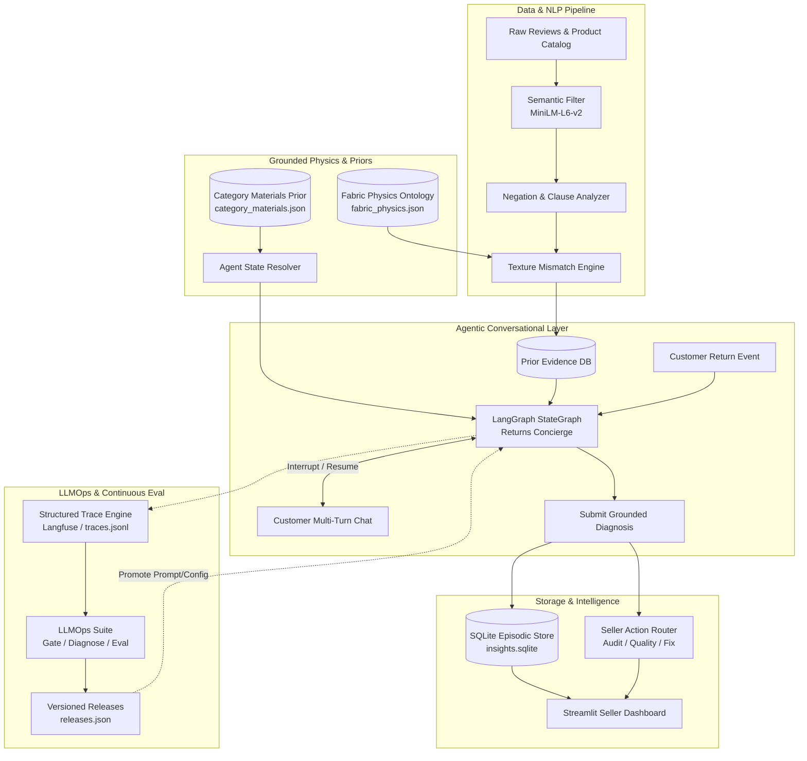

# True-Texture Returns Intelligence Platform
## Technical Documentation & Architectural Blueprint

> **Author**: Staff AI Systems Engineer  
> **Status**: Production Architecture & System Specification  
> **Target Audience**: AI Engineers, Full-Stack Developers, MLOps/LLMOps Engineers, and Technical Leads  

---

### Executive Summary

Online fashion ecommerce suffers from massive product return rates (**25% to 35%** in high-growth markets like India, representing over **$5.5B–$7.5B** in returned GMV annually). While size and fit tools have matured, **material and texture mismatch** ("felt cheap/plasticky", "polyester sold as cotton", "rough satin", "sweaty synthetic fabric") represents the single largest unaddressed driver of returns and seller margin loss.

**True-Texture** is an end-to-end, production-grade AI intelligence system that tackles texture mismatch returns through a multi-stage cognitive pipeline:
1. **Unsupervised Review Mining**: Extracts customer tactile ground truth from tens of thousands of unstructured reviews using semantic similarity and negation-aware NLP.
2. **Deterministic Fabric Physics Ontology**: Grounds fiber claims against physical tactile expectations, weave constructions, thermal properties, and synthetic substitution signatures.
3. **Agentic Returns Concierge (LangGraph)**: An autonomous multi-turn conversational agent that conducts human-in-the-loop diagnostic return interviews to identify the root cause in $\le 3$ questions.
4. **Context-Engineered Cognitive Memory**: Structured 3-tier memory system (Semantic, Procedural, and Episodic) optimized for LLM prefix/KV cache efficiency.
5. **Closed-Loop LLMOps & Evaluation Harness**: Tracing, regression testing on golden evaluation sets, multi-dimensional semantic grading, and release gating with Langfuse integration.
6. **Seller Intelligence Portal**: Streamlit-powered intelligence dashboard providing actionable, evidence-backed supply chain and listing remedies.

---

### Documentation Structure

| Document | Focus & Highlights |
| :--- | :--- |
| **[01. System Architecture](01_system_architecture.md)** | Core system topology, LangGraph StateGraph lifecycle, 3-tier memory layers, KV-cache prefix optimization, and end-to-end data flow. |
| **[02. Data & NLP Pipeline](02_data_pipeline_nlp.md)** | HuggingFace dataset ingestion, MiniLM semantic sentence filtering (calibrated 0.50 threshold), SBAR dependency-based negation pruning, and mismatch diagnosis. |
| **[03. Conversational Agent & LangGraph](03_conversational_agent_langgraph.md)** | LangGraph workflow implementation, human-in-the-loop `interrupt` mechanics, tool calling protocols (`ask_question`, `submit_diagnosis`), and dynamic context engineering. |
| **[04. Fabric Physics & Ontology Engine](04_physics_ontology_engine.md)** | Heuristic fabric ontology, orthogonal fiber vs. weave axes, category prior mapping, and the deterministic 2×2 diagnostic response matrix. |
| **[05. LLMOps, Observability & Evals](05_llmops_observability_evals.md)** | End-to-end tracing, Portkey integration, Langfuse callbacks, multi-metric golden eval harness, diagnostic regression root-causing, and release gating. |
| **[06. Seller Intelligence Dashboard](06_seller_intelligence_dashboard.md)** | Streamlit frontend architecture, real-time KPI metrics, evidence drill-down, and automated supply-chain remediation ticketing. |
| **[07. Developer Operations Guide](07_developer_guide_operations.md)** | Local environment setup, UV toolchain, environment variables, offline/mock testing, and command reference for pipeline execution. |

---

### Technology Stack

* **Language Runtime**: Python 3.12+ (managed with `uv`)
* **Agentic Framework**: [LangGraph](https://github.com/langchain-ai/langgraph) (StateGraph with `MemorySaver` checkpointer & interrupt-driven state resumption)
* **LLM Orchestration & Gateway**: [Portkey AI](https://portkey.ai/) + [LangChain](https://github.com/langchain-ai/langchain) (supports OpenAI, Anthropic, Gemini, Groq, Bedrock, and Mock providers)
* **Embeddings & NLP**: `sentence-transformers` (`all-MiniLM-L6-v2`), PyTorch, scikit-learn
* **Observability & LLMOps**: [Langfuse](https://langfuse.com/) (OpenTelemetry-compatible LLM tracing), local JSONL traces, custom regression gates
* **Persistence & Storage**: SQLite 3 (Episodic memory store), JSONL structured streams
* **User Interface**: Streamlit (wide-layout analytics dashboard)
